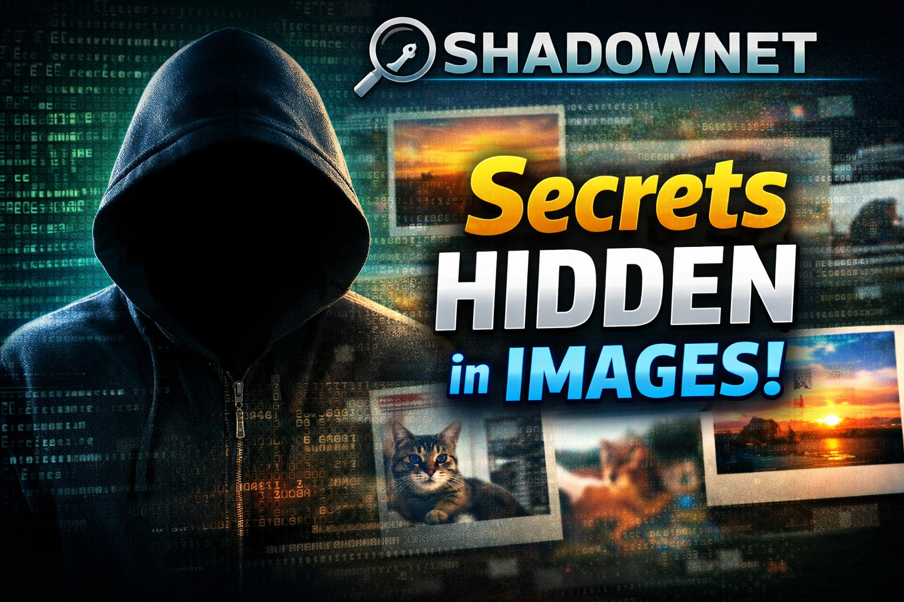

## 👇🏻 Click the below image to watch the SHADOWNET Demo video 

# 🕵️‍♂️ SHADOWNET

  <em>
    A <b>steganography-based social network</b> that hides secret communication 
    within innocent images, turning social media into a <b>covert privacy tool</b>.
  </em>

  <em>
  🚀 Built as a <b>team project</b> for <b>Devfest 5.0 Goa</b>
  </em>

---

## 🌐 Live Demo

  <em>
    Experience the hidden world: 
    🔗 <a href="https://shadownet-1eace.web.app/"><b>Visit SHADOWNET</b></a>
  </em>

---

## 📖 Overview

 
    <em> 
        <b>SHADOWNET</b> is a <b>privacy-first social media platform</b> that enables <b>hidden communication</b> using <b>steganography</b>, where messages are invisibly embedded inside images instead of being stored as text. 
    </em> 

 
    <em>
         To the public, the platform appears as a normal social feed of photos, memes, and videos. Behind the scenes, encrypted messages are concealed within pixel data and can only be revealed by users who possess the correct <b>secret key</b>. 
    </em> 

 
    <em> 
        SHADOWNET eliminates traditional chat databases entirely — <b>images themselves act as the data layer</b>. This design supports secure, censorship-resistant, and deniable communication for journalists, activists, privacy-conscious users, and creative communities. 
    </em>

 
    <em> 
        Built during <b>DevFest 5.0, Goa</b>, SHADOWNET challenges conventional ideas of social networking by combining <b>security, creativity, and usability</b> into a single stealth-based communication system. 
    </em>

---

## ✨ Core Features

<em>🔐 <b>Authentication</b> — Secure user sign-in and logout using Firebase Authentication.</em>
 

<em>📰 <b>Public Feed</b> — A normal-looking social feed of images, memes, and videos with likes, comments, and sharing.</em>
 

<em>👥 <b>Friends & Connections</b> — Search users, send connection requests, manage friends, and chat privately.</em>

<em>🧪 <b>Encode Media</b> — Hide encrypted messages inside images or videos using steganography with secret-key protection.</em>
 

<em>🎭 <b>Decoy Content</b> — Optional fake messages to mislead unauthorized viewers and enhance plausible deniability.</em>
 

<em>⏳ <b>Self-Destruct Posts</b> — Automatically delete posts after a specified number of views or time duration.</em>
 

<em>🔍 <b>Decode Messages</b> — Extract hidden messages by uploading media and providing the correct secret key.</em>
 

<em>🖼️ <b>Media-as-Database</b> — No text chat storage; images themselves act as the message carrier and data layer.</em>
 

<em>👤 <b>User Profile Management</b> — Edit profile details, display picture, bio, and manage personal posts.</em>
 

<em>🔐 <b>Privacy-First Design</b> — Server never reads hidden content; all encoding and decoding happens client-side.</em>
 

<em>⚡ <b>Real-Time Interactions</b> — Live updates for posts, likes, comments, and chats using Firebase services.</em>

---

## 🧠 System Architecture

 <em> <b>SHADOWNET</b> follows a <b>client-heavy, privacy-first architecture</b> where sensitive operations like encryption and decryption happen on the <b>user’s device</b>, and the backend acts only as a secure data carrier. </em> 

- **Frontend** → React + TypeScript (UI, state management, social interactions)

- **Steganography Engine** → Client-side image encoding & decoding using JavaScript utilities

- **Backend Services** → Firebase Firestore & Firebase Storage (posts, metadata, media)
 
- **Authentication** → Firebase Authentication (secure sign-in / sign-out)

- **Real-Time Features** → Firestore listeners for feed, likes, comments, and chat

- **Privacy Layer** → No text-message database; images act as the data layer

- **Hosting** → Firebase Hosting (production deployment)

 <em> In SHADOWNET, the <b>server never knows the hidden message</b>. Images appear normal in public feeds, while only users with the correct <b>secret key</b> can extract encrypted data — making communication <b>deniable, censorship-resistant, and stealth-based</b>. </em> 

---

## 🧰 Tech Stack

 
     
     
     
     

**Frontend**

- React + TypeScript
- Vite
- Client-side steganography (image & video encoding / decoding)

**Backend / Services**
- Firebase Authentication
- Firebase Firestore (real-time feed, likes, comments, chat)
- Firebase Storage (media hosting)
- Firebase Hosting

**Security / Processing**
- JavaScript-based steganography utilities
- Client-side encryption & decryption
- Optional auto-expiry logic (time / view based)

---

## ✅ Real-World Use Cases 

### 🥇 Journalists & Whistleblowers
- No visible conversation trail
- Messages hidden in plain sight
- Encrypted chats without raising suspicion  
📌 *Freedom of press & secure sourcing*

---

### 🥇 Anti-Censorship Communication
- Works in regions where messaging apps are blocked
- Avoids keyword-based surveillance  
📌 *Images and memes bypass intent detection*

---

### 🥇 Privacy-First Personal Messaging
- No chat logs stored forever
- Server never knows message content  
📌 *Privacy by design, not policy*

---

### 🥇 Secure One-Time Information Sharing
- Wi-Fi passwords
- Exam room info
- Temporary internal notes  
📌 *Message disappears with the image*

---

### 🥇 Creative & Artistic Communication
- Poems hidden in artwork
- Easter eggs in posts
- Secret communities  
📌 *Art + cryptography crossover*

---

## 🧭 Application Features

### 🔐 Authentication
- Sign up / Login
- Secure session handling
- Logout support

---

### 📰 Public Feed
- Two filters:
  - **Connected Users**
  - **All Posts**
- Like, comment, and share posts
- Looks like a normal social feed

---

### 👥 Friends
- Search users
- Send / accept connections
- One-to-one chat system

---

### 🧪 Encode (Core Feature)

**Step-by-step flow:**
1. Select image or video
2. Add caption & public content
3. Optional hidden message (key-protected)
4. Optional fake message (decoy)
5. Auto-delete after:
   - X views **or**
   - X minutes

---

### 🔍 Decode
- Upload image
- Enter secret key
- Extract and view hidden message

---

### 👤 User Section
- Edit profile (DP, bio, etc.)
- View own posts
- Manage active content

---
## 🔐 Security Philosophy
- No plaintext messages stored
- Encrypted data hidden inside media
- Key-based decoding
- Optional self-destruct logic
- Minimal server knowledge
- Images are treated as data vaults.
---

## 🧠 What We Learned
- Steganography in real-world applications
- Client-side encryption principles
- Designing privacy-first systems
- Secure social feed architecture
- Firebase service layering
- Hackathon-scale product thinking
- Balancing UX with security
---

## 👥 Team – Devfest 5.0 Goa Submission

  <em>
    This project was built as a <b>group submission</b> for <b>Devfest 5.0</b> by:
  </em>

  <em>
    <b>Subham Kolay</b> 
    <b>Asmita Chakraborty</b> 
    <b>Soumyadeep Saha</b> 
    <b>Trishit Majumdar</b>
  </em>

  <em>
    Hooghly Engineering And Technology College 
    BTech <b>Computer Science</b>.
  </em>

---

## 🚀 Future Scope
- End-to-end encrypted group drops
- Watermark-resistant encoding
- Mobile app version
- Anonymous publishing mode
- Decentralized storage integration
---

## ⭐ Support

  <em>
    If you find <b>SHADOWNET</b> interesting or impactful,  
    consider giving this repository a ⭐ — it motivates our team to keep building!
  </em>

---

  

